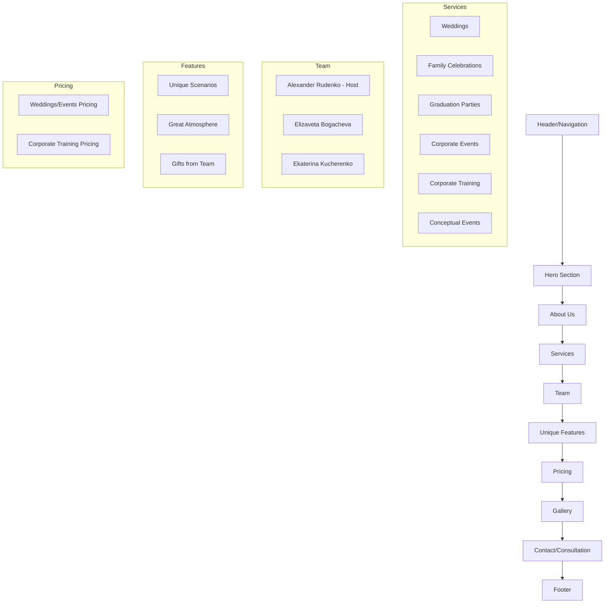

# Event Agency "Тринадцать" - Website Architectural Plan

## Website Structure Plan

## Detailed Implementation Plan

### 1. Design & Color Scheme
- **Vibrant Color Palette**: Use energetic colors like deep purples (#6A0DAD), bright pinks (#FF69B4), electric blues (#00BFFF), and gold accents (#FFD700)
- **Typography**: Modern sans-serif fonts for headings (e.g., "Montserrat" or "Poppins") with a readable body font
- **Layout**: Responsive grid system with ample white space to prevent visual overload

### 2. Key Sections

#### Header/Navigation
- Fixed navigation bar with logo and menu items
- Mobile-friendly hamburger menu for smaller screens
- Call-to-action button: "Book Consultation"

#### Hero Section
- Full-width banner with the main cover image
- Overlay text: "Event Agency 'Thirteen' - Your Unforgettable Events"
- Prominent "Book Free Consultation" button
- Brief tagline: "Weddings, Corporate Events, Family Celebrations in Moscow"

#### About Us
- Brief introduction to the agency
- Key differentiators: "18 years of experience"
- "100% guaranteed result - a party you'll remember forever!"

#### Services
- Six service cards with icons/images:
  1. Weddings
  2. Family Celebrations
  3. Graduation Parties
  4. Corporate Events
  5. Corporate Training
  6. Conceptual Events
- Each with a brief description and "Learn More" button

#### Team
- Profile cards for key team members:
  - Alexander Rudenko (main host)
  - Elizaveta Bogacheva
  - Ekaterina Kucherenko
- Photos with role descriptions and expertise highlights

#### Unique Features
- Three-column layout highlighting:
  1. Unique Scenarios (short film concept)
  2. Great Atmosphere (competitions, quizzes)
  3. Gifts from Team (video interviews, improv shows, quizzes)

#### Pricing
- Two distinct pricing sections:
  1. Weddings/Events pricing table
  2. Corporate Training pricing
- Clear value propositions with "Gift" indicators

#### Gallery
- Interactive grid of event photos
- Lightbox functionality for full-screen viewing
- Navigation arrows and close button
- Responsive grid layout (2-4 columns based on screen size)

#### Contact/Consultation
- Prominent booking form with fields:
  - Name
  - Phone
  - Email
  - Event Type
  - Date (optional)
  - Message
- Contact information:
  - Phone: +7 977 775 34 53 (Alexander)
  - Email: productioncentre13@gmail.com
  - Address: Moscow, Smirnovskaya st. 2 str.1, office 119a
- Social media links

#### Footer
- Copyright information
- Additional links:
  - Rutube channel
  - Telegram channel
  - KVN team Telegram
  - Improv studio courses
- Working hours: "We work without weekends"

### 3. Technical Implementation

#### HTML Structure
- Semantic HTML5 elements
- Properly nested sections and articles
- Accessible form elements with labels
- Image optimization with appropriate alt attributes

#### CSS Features
- Flexbox and Grid for layouts
- CSS animations for interactive elements
- Responsive design with media queries
- Custom properties for consistent theming
- Hover effects on buttons and cards

#### JavaScript Functionality
- Mobile navigation toggle
- Gallery lightbox with keyboard navigation
- Form validation and submission handling
- Smooth scrolling for navigation
- Dynamic elements as needed

### 4. UX Considerations
- Fast loading times with optimized assets
- Clear visual hierarchy guiding users to booking
- Intuitive navigation with breadcrumbs where appropriate
- Accessible color contrast ratios
- Touch-friendly elements for mobile users
- Form validation with helpful error messages

### 5. Special Features
- Lightbox gallery for showcasing event photos
- Animated transitions between sections
- Interactive service cards with hover effects
- Sticky booking button visible on all pages
- Social proof through team credentials and experience
